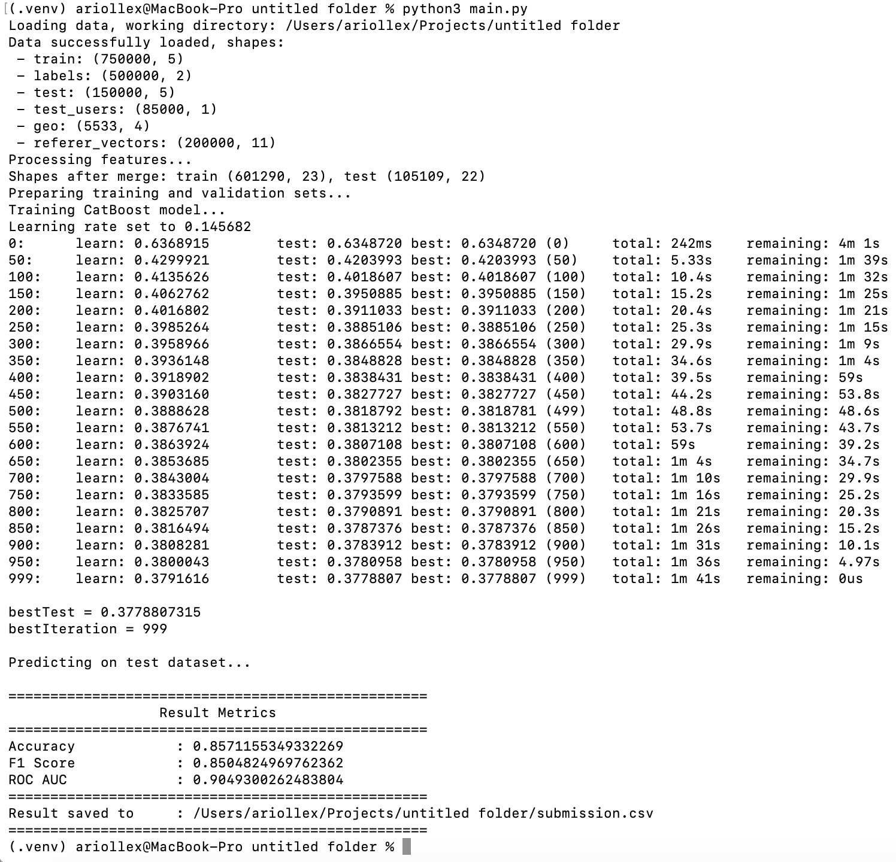

# VK Education Practice 2025: Предсказание пола пользователей соцсетей

## Описание
Проект выполнен в рамках практики VK Education Practice 2025.

```Вам необходимо разработать модель машинного обучения, которая будет предсказывать пол пользователя соцсетей.```

## Структура проекта
```
main.py                # Основной скрипт для подготовки данных, обучения модели и генерации результата
requirements.txt       # Список зависимостей Python 3
data/                  # Каталог с необходимыми входными данными. Не загружены в репозиторий.
output/                # Каталог для результатов (submission.csv). Не загружены в репозиторий.
```  

## Установка зависимостей
```bash
# Рекомендуется создать и активировать виртуальное окружение (venv, conda и т.п.)
pip install -r requirements.txt
```

## Использование
```bash
# Убедитесь, что в каталоге data/ присутствуют все требуемые файлы:
# train.csv, train_labels.csv, test.csv, test_users.csv, geo_info.csv, referer_vectors.csv
python main.py
```
Результат - файл `submission.csv` - после выполнения программы будет находится в каталоге `output/`.

## Метрика качества
Проект выводит следующие метрики на валидационной выборке:
- Accuracy
- F1 Score
- ROC AUC

## Демонстрация

